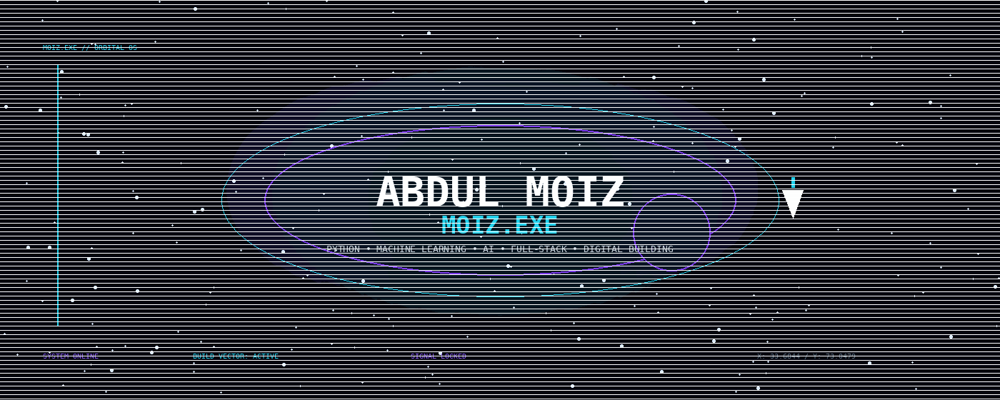
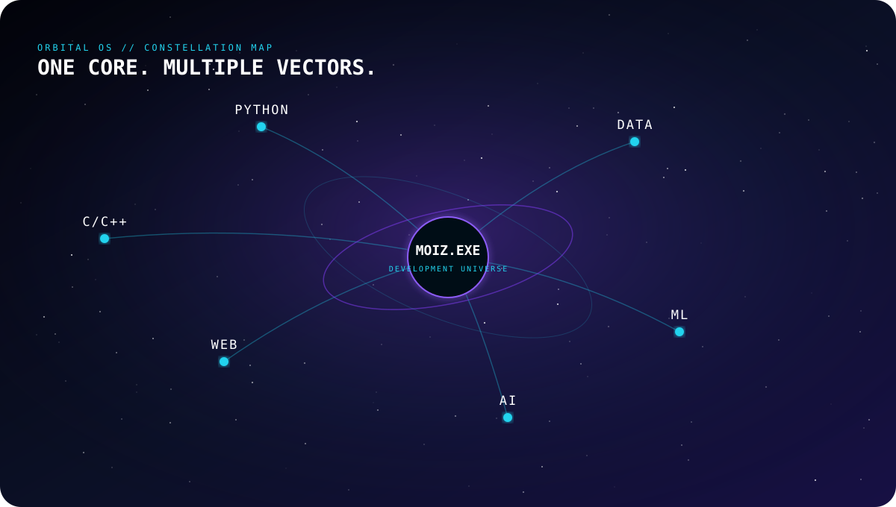
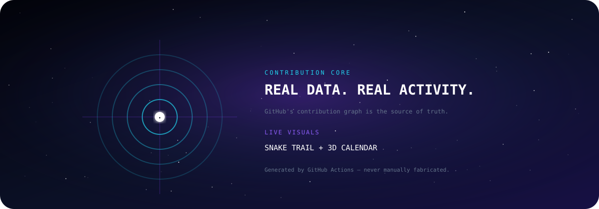

<!-- ═══════════════════════════════════════════════════════════════
     MOIZ-EXE — ORBITAL OS
     ═══════════════════════════════════════════════════════════════ -->

<div align="center">

<a href="https://github.com/moiz-exe">
  
</a>

<br/>

# ABDUL MOIZ

### `FUTURE FULL STACK DEVELOPER`


<br/>

<a href="https://github.com/moiz-exe">

</a>

<a href="https://www.linkedin.com/in/abdulmoiz495/">

</a>

</div>

---

## 🌌 ABOUT

I'm **Abdul Moiz**, a developer building my skills through programming, data, Machine Learning and interactive web projects.

Currently exploring:

`Python` · `C/C++` · `Data` · `Machine Learning` · `AI` · `Web Development`

> **Learn → Build → Break → Improve**

---

## 🛰️ DEVELOPMENT UNIVERSE



<div align="center">


</div>

---

## 🚀 SELECTED PROJECTS

<table>
<tr>

<td width="50%" valign="top">

### ⚛️ Physics HSSC

Interactive physics revision platform featuring formulas, numericals, cheatsheets, practice and chapter resources.

**Python · HTML · CSS · JavaScript**

<a href="https://github.com/moiz-exe/Physics-HSSC">Repository →</a>

</td>

<td width="50%" valign="top">

### 🧪 Physics PBA

Interactive physics practical learning platform covering experiments, apparatus, procedures, calculations, graphs and MCQs.

**Web · Education · Interactive**

<a href="https://github.com/moiz-exe/PBA">Repository →</a>

</td>

</tr>

<tr>

<td width="50%" valign="top">

### 🤖 Machine Learning

Hands-on ML experiments covering datasets, regression, Scikit-learn, training and predictions.

**Python · ML · Scikit-learn**

<a href="https://github.com/moiz-exe/Machine-Learning">Repository →</a>

</td>

<td width="50%" valign="top">

### 🐍 Python × MOIZ

Python fundamentals and programming practice covering variables, strings, lists, tuples and core concepts.

**Python · Jupyter**

<a href="https://github.com/moiz-exe/Python-x-MOIZ">Repository →</a>

</td>

</tr>
</table>

---

## 🧠 CURRENT MISSION

```text
PYTHON
   ↓
DATA
   ↓
MACHINE LEARNING
   ↓
ARTIFICIAL INTELLIGENCE
   ↓
FULL STACK DEVELOPMENT
   ↓
REAL PROJECTS
````

**Building the skills today for bigger systems tomorrow.**

---

## 📊 GITHUB SIGNAL

<div align="center">

<a href="https://github.com/moiz-exe">

</a>

<a href="https://github.com/moiz-exe">

</a>

<br/><br/>


</div>

---

## 🐍 CONTRIBUTION CORE

<div align="center">



<br/>

<picture>
  <source
    media="(prefers-color-scheme: dark)"
    srcset="https://raw.githubusercontent.com/moiz-exe/moiz-exe/output/github-snake-dark.svg"
  />
  <source
    media="(prefers-color-scheme: light)"
    srcset="https://raw.githubusercontent.com/moiz-exe/moiz-exe/output/github-snake.svg"
  />
  
</picture>

</div>

---

<div align="center">

### `EXPLORE • BUILD • IMPROVE`

<a href="https://github.com/moiz-exe?tab=repositories">

</a>

<br/><br/>

**© Abdul Moiz · moiz-exe**

</div>
