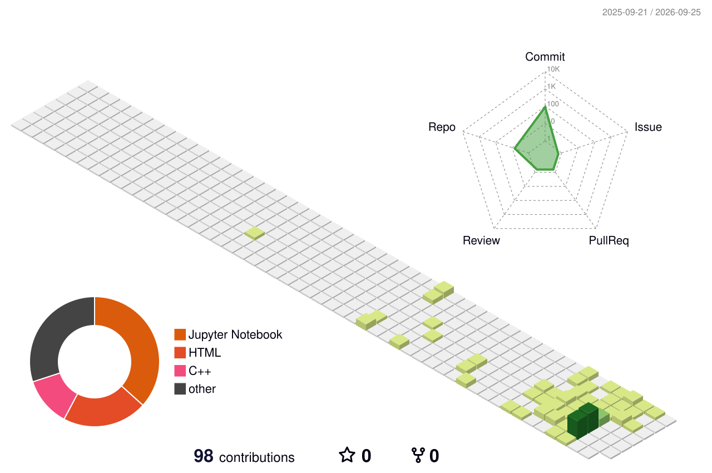

<div align="center">

#  Hey, I'm Abdul Moiz

### `Python Developer` • `Machine Learning Learner` • `Digital Builder`


<br/>

<a href="https://github.com/moiz-exe">
  
</a>


<br/><br/>

> ### ⚡ **I'm not waiting to become great before I start building. I'm building to become great.**

</div>

---


# 🧠 About Me

I'm **Abdul Moiz**, a passionate learner and developer focused on building strong foundations in **Python, programming, data, and Machine Learning**.

My GitHub is more than a collection of code.

It is a **record of my progress**.

From writing my first Python programs to experimenting with Machine Learning and creating interactive web projects, every repository represents something new I've learned and built.

```python
class AbdulMoiz:
    def __init__(self):
        self.role = "Developer & Lifelong Learner"
        self.currently_learning = [
            "Python",
            "Machine Learning",
            "Data Analysis"
        ]
        self.interests = [
            "Artificial Intelligence",
            "Problem Solving",
            "Building Useful Projects"
        ]
        self.mindset = "Keep learning. Keep building. 🚀"

    def future(self):
        return "AI • Machine Learning • Real-World Projects"
```

<br clear="right"/>

---

# ⚔️ MY DEVELOPMENT JOURNEY

```text
                         ┌───────────────────┐
                         │   🌱 CURIOSITY    │
                         └─────────┬─────────┘
                                   │
                                   ▼
                         ┌───────────────────┐
                         │   🐍 PYTHON       │
                         │  Fundamentals     │
                         └─────────┬─────────┘
                                   │
                                   ▼
                    ┌────────────────────────────┐
                    │ 📊 DATA & VISUALIZATION    │
                    └──────────────┬─────────────┘
                                   │
                                   ▼
                    ┌────────────────────────────┐
                    │ 🤖 MACHINE LEARNING        │
                    └──────────────┬─────────────┘
                                   │
                                   ▼
                    ┌────────────────────────────┐
                    │ 🧠 ARTIFICIAL INTELLIGENCE │
                    └──────────────┬─────────────┘
                                   │
                                   ▼
                         ┌───────────────────┐
                         │ 🚀 BUILD THE FUTURE│
                         └───────────────────┘
```

---

# 🛠️ Tech Stack

<div align="center">

### 💻 Languages & Core


<br/><br/>

### 📊 Data & Machine Learning


</div>

---

# 🚀 Featured Projects

<table>
<tr>
<td width="50%" valign="top">

## 🐍 Python × MOIZ

**Where my programming journey is documented.**

A personal collection of Python notebooks covering my journey from the basics onwards.

`Python` `Jupyter` `Learning`

### → [Explore Repository](https://github.com/moiz-exe/Python-x-MOIZ)

</td>

<td width="50%" valign="top">

## 🤖 Machine Learning

**Learning ML by building and experimenting.**

A growing repository documenting my Machine Learning journey, models, datasets, experiments, and implementations.

`Python` `Scikit-learn` `ML`

### → [Explore Repository](https://github.com/moiz-exe/Machine-Learning)

</td>
</tr>

<tr>
<td width="50%" valign="top">

## ⚡ Physics HSSC

**An interactive revision experience.**

A web-based project bringing physics concepts, formulas, numericals, revision material, and practice together.

`HTML` `CSS` `JavaScript`

### → [Explore Project](https://moiz-exe.github.io/Physics-HSSC/)

</td>

<td width="50%" valign="top">

## 🧪 Physics PBA

**Interactive practical physics learning.**

Explore experiments, procedures, apparatus, observations, calculations, graphs, and practice in one digital platform.

`HTML` `CSS` `JavaScript`

### → [Explore Project](https://moiz-exe.github.io/PBA/)

</td>
</tr>
</table>

---

# 📈 My GitHub Activity

# 📊 GitHub Activity

<div align="center">


<br><br>


</div>

---

# 🌌 My GitHub in 3D

<div align="center">



</div>

> **Every contribution is a step forward.**

---

# 🐍 The Commit Snake

<div align="center">


</div>

### 🐍

```text
Commits → Contributions → Progress → Repeat.
```

---

# ⚡ BUILDING MY FUTURE IN PUBLIC

### Every repository is a lesson.

### Every project is progress.

### Every line of code is one step forward.

<br/>


<br/><br/>


</div>


---

# 🎯 Currently Leveling Up

```text
PYTHON                 ████████████░░░░░░  Building Foundation 🐍
DATA ANALYSIS          ████████░░░░░░░░░░  Learning 📊
MACHINE LEARNING       ██████░░░░░░░░░░░░  Exploring 🤖
WEB PROJECTS           ████████████░░░░░░  Building 🌐
ARTIFICIAL INTELLIGENCE ████░░░░░░░░░░░░░░  Next Mission 🧠
```

### Current Mission

```python
while True:
    learn()
    practice()
    build()
    fail()
    debug()
    improve()

    if goal_reached:
        set_bigger_goal()
```

---

# 🧭 What Drives Me

<table>
<tr>
<td align="center" width="33%">

### 🧠 Learn Deeply

I want to understand **how things work**, not just copy code.

</td>

<td align="center" width="33%">

### ⚙️ Build Continuously

The best way to learn is to turn knowledge into **real projects**.

</td>

<td align="center" width="33%">

### 🚀 Keep Growing

Today's beginner can become tomorrow's expert by **refusing to stop**.

</td>
</tr>
</table>

---

# 🗺️ The Road Ahead

```text
2026
 │
 ├── 🐍 Master Python
 │
 ├── 📊 Strengthen Data Analysis
 │
 ├── 🤖 Build Machine Learning Projects
 │
 ├── 🧠 Explore Artificial Intelligence
 │
 ├── 🚀 Create Bigger Real-World Projects
 │
 └── 🔥 Never Stop Learning
```

---

<div align="center">

# ⚡ BUILDING MY FUTURE IN PUBLIC

### Every repository is a lesson.

### Every project is progress.

### Every line of code is one step forward.

<br/>


<br/><br/>

### ⭐ *Code. Learn. Build. Repeat.*

**— Abdul Moiz (@moiz-exe)**

</div>
