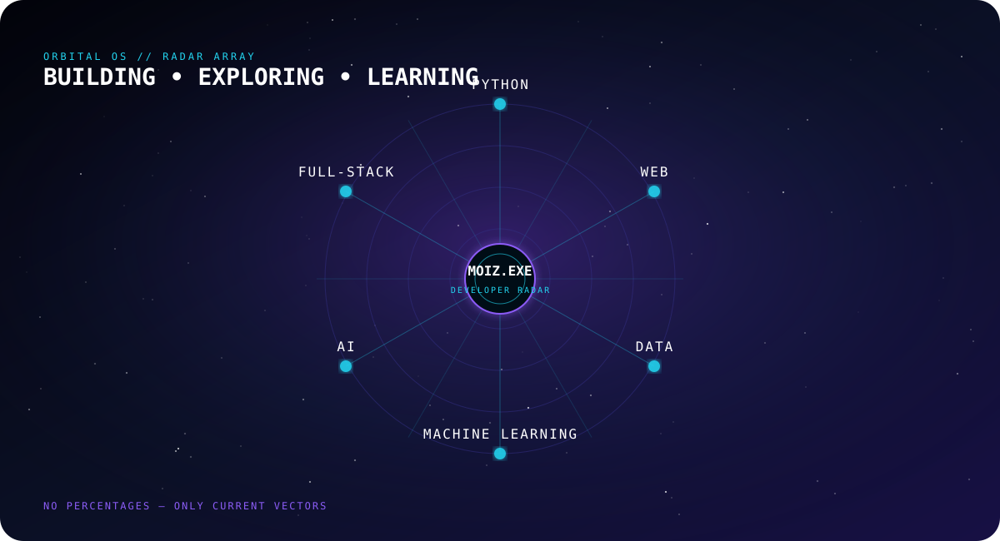
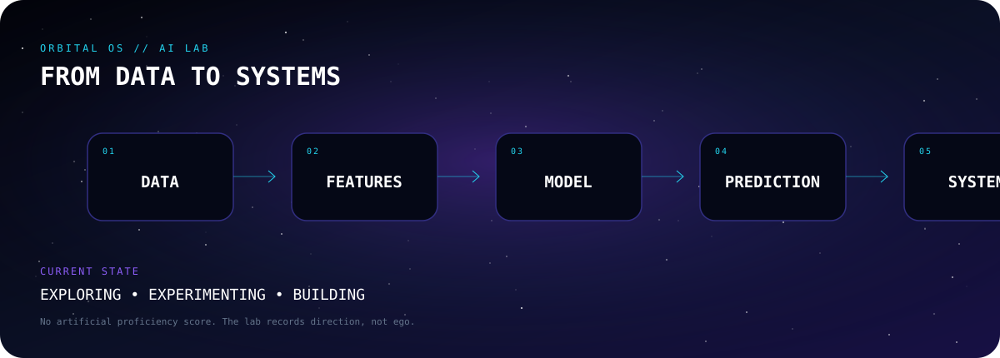
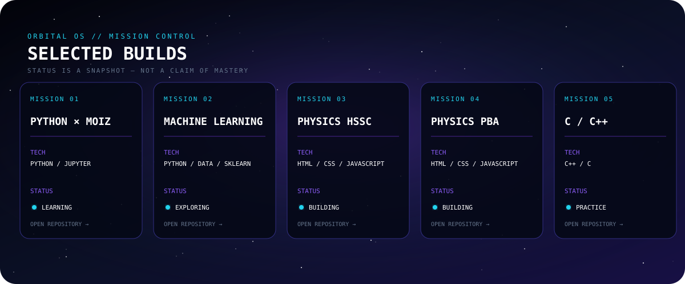
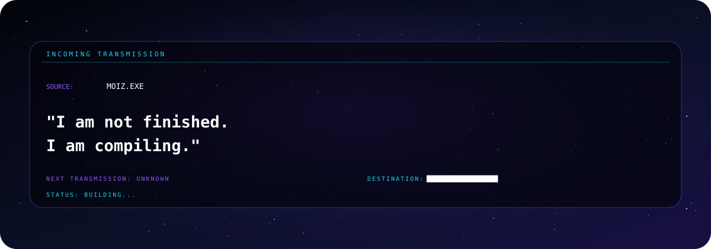

<!-- ═══════════════════════════════════════════════════════════════
     MOIZ-EXE — ORBITAL OS
     GitHub Profile README
     ═══════════════════════════════════════════════════════════════ -->

<div align="center">

<a href="https://github.com/moiz-exe">
  
</a>

<br/>

# ABDUL MOIZ

### `DEVELOPER · BUILDER · DIGITAL CREATOR`


<br/>


</div>

---

## ◉ ORBITAL STATUS

```text
┌──────────────────────────────────────────────────────────────────────┐
│                         ORBITAL OS / 01                              │
├──────────────────────────────────────────────────────────────────────┤
│                                                                      │
│  OPERATOR       Abdul Moiz                                          │
│  HANDLE         moiz-exe                                             │
│  STATUS         ONLINE                                               │
│  MODE           BUILD / LEARN / SHIP                                │
│  PRIMARY        Python • C • AI/ML • Automation                      │
│  SECONDARY      SEO • Digital Marketing • Content                    │
│  LOCATION       Pakistan                                             │
│                                                                      │
│  CURRENT MISSION                                                     │
│  Turn concepts into useful digital products, systems and content.    │
│                                                                      │
└──────────────────────────────────────────────────────────────────────┘
````

<div align="center">

**I don't just collect technologies — I build with them.**

</div>

---

## 🌌 THE DEVELOPER BEHIND THE SIGNAL

I'm **Abdul Moiz**, a developer and digital creator focused on building practical technology, experimenting with AI, automation and programming, and turning ideas into useful digital experiences.

My work sits at the intersection of:

**Software × AI × Automation × Digital Growth × Content**

I'm continuously learning, experimenting with new technologies, and building projects that solve real problems.

```text
LEARN
   ↓
EXPERIMENT
   ↓
BUILD
   ↓
BREAK
   ↓
IMPROVE
   ↓
SHIP
   ↓
REPEAT
```

---

## 🛰️ DEVELOPMENT UNIVERSE


<br/>

<table align="center">
<tr>

<td align="center" width="25%">

### 🐍

**PYTHON**

Automation
AI/ML
Tools
Projects

</td>

<td align="center" width="25%">

### ⚙️

**C**

Fundamentals
Logic
Systems
Problem Solving

</td>

<td align="center" width="25%">

### 🧠

**AI / ML**

Experiments
AI Tools
Automation
Research

</td>

<td align="center" width="25%">

### 📡

**DIGITAL**

SEO
Marketing
Content
Growth

</td>

</tr>
</table>

---

## 🧬 TECHNOLOGY RADAR



<br/>

<div align="center">

### LANGUAGES


### DEVELOPMENT & TOOLS


### AI / DATA


</div>

---

## 🧪 AI LAB



I'm interested in turning AI from a conversation into an actual working system.

### Areas I'm exploring

```text
┌─────────────────────┐
│ Artificial Intel.   │
├─────────────────────┤
│ Machine Learning    │
│ AI Automation       │
│ Prompt Engineering  │
│ Intelligent Tools   │
│ Data & Analysis     │
│ AI-assisted Coding  │
└─────────────────────┘
```

**The goal isn't simply to use AI.**

**The goal is to build things with it.**

---

## 🚀 SELECTED MISSIONS



### ⚛️ Physics HSSC

An educational web project designed around physics learning and exam preparation.

**Focus:** Education · Web · Students · Content

---

### 📚 FBISE / HSSC Resources

Educational content and resources focused on examination preparation, important questions, study material and student guidance.

**Focus:** Education · Research · Content · Community

---

### 🤖 AI & Automation Experiments

Programming experiments exploring how AI and automation can simplify repetitive work and create useful tools.

**Focus:** Python · AI · Automation · Experimentation

---

### 📈 Digital Growth Projects

Projects combining technology with SEO, digital marketing, content strategy and online growth.

**Focus:** SEO · Marketing · Analytics · Content

---

## 🔭 BUILD PHILOSOPHY

```text
                 ┌───────────────┐
                 │     IDEA      │
                 └───────┬───────┘
                         │
                         ▼
                 ┌───────────────┐
                 │   RESEARCH    │
                 └───────┬───────┘
                         │
                         ▼
                 ┌───────────────┐
                 │   PROTOTYPE   │
                 └───────┬───────┘
                         │
                         ▼
                 ┌───────────────┐
                 │    BUILD      │
                 └───────┬───────┘
                         │
                         ▼
                 ┌───────────────┐
                 │    TEST       │
                 └───────┬───────┘
                         │
                         ▼
                 ┌───────────────┐
                 │    SHIP       │
                 └───────┬───────┘
                         │
                         ▼
                 ┌─────────────────┐
                 │    ITERATE      │
                 └─────────────────┘
```

> **Build small. Think big. Keep improving.**

---

## 📡 CURRENT TRANSMISSION



```yaml
focus:
  - Python
  - C programming
  - AI / ML
  - Automation
  - Software projects
  - SEO
  - Digital marketing

currently_learning:
  - Artificial Intelligence
  - Machine Learning
  - Advanced Python
  - Software development
  - Automation systems

mindset:
  - curiosity
  - experimentation
  - consistency
  - problem solving
  - continuous improvement
```

---

## 📊 GITHUB ACTIVITY

<div align="center">

<a href="https://github.com/moiz-exe">
  
</a>

<a href="https://github.com/moiz-exe">
  
</a>

</div>

<br/>

<div align="center">

<a href="https://github.com/moiz-exe">
  
</a>

</div>

---

## 🐍 CONTRIBUTION CORE

<div align="center">


<br/><br/>

<picture>
  <source
    media="(prefers-color-scheme: dark)"
    srcset="https://raw.githubusercontent.com/moiz-exe/moiz-exe/output/github-snake-dark.svg"
  />
  <source
    media="(prefers-color-scheme: light)"
    srcset="https://raw.githubusercontent.com/moiz-exe/moiz-exe/output/github-snake.svg"
  />
  
</picture>

</div>

---

## 📡 CONTRIBUTION SIGNAL

<div align="center">

<a href="https://github.com/moiz-exe">
  
</a>

</div>

---

## 🛠️ WHAT I BUILD

<table>
<tr>

<td width="50%" valign="top">

### 💻 SOFTWARE

* Python applications
* C programs
* Automation scripts
* Utility tools
* Educational software
* Developer tools
* APIs & integrations

</td>

<td width="50%" valign="top">

### 🤖 AI & AUTOMATION

* AI experiments
* AI-powered workflows
* Prompt systems
* Data processing
* Automation pipelines
* Productivity tools

</td>

</tr>

<tr>

<td width="50%" valign="top">

### 📈 DIGITAL GROWTH

* SEO
* Social media marketing
* Google Ads
* Meta Ads
* Email marketing
* Content strategy

</td>

<td width="50%" valign="top">

### 🌐 DIGITAL PRODUCTS

* Educational websites
* Landing pages
* Content platforms
* Student resources
* Online tools
* Experimental products

</td>

</tr>
</table>

---

## 🌠 THE NEXT ORBIT

```text
                    ╭──────────────────╮
                    │   NEXT MISSION   │
                    ╰────────┬─────────╯
                             │
             ┌───────────────┼───────────────┐
             │               │               │
             ▼               ▼               ▼
        ┌─────────┐     ┌──────────┐    ┌───────────┐
        │   AI    │     │ SOFTWARE │    │  DIGITAL  │
        │ SYSTEMS │     │ PRODUCTS │    │  GROWTH   │
        └────┬────┘     └────┬─────┘    └─────┬─────┘
             │               │                │
             └───────────────┼────────────────┘
                             ▼
                    ┌─────────────────┐
                    │  REAL-WORLD     │
                    │    IMPACT       │
                    └─────────────────┘
```

I'm building toward projects that are:

**useful · scalable · intelligent · accessible · memorable**

---

## 🌍 BEYOND THE CODE

Technology is only one part of the journey.

I also work around:

* 🎓 Education & student communities
* 📚 Educational content
* 📈 Digital marketing
* 🔎 Search & SEO
* ✍️ Content creation
* 🤖 AI experimentation
* 🌐 Digital products

**The interesting part is where these worlds overlap.**

---

## ⚡ WHY ORBITAL OS?

```text
ORBITAL

Not static.
Not finished.
Always moving.

OS

A workspace for ideas,
experiments, projects,
systems and missions.
```

Every project is another orbit.

Every contribution is another signal.

Every experiment teaches something.

---

## 🤝 CONNECT WITH ME

<div align="center">

<a href="https://github.com/moiz-exe">
  
</a>

<a href="https://www.linkedin.com/in/abdulmoiz495/">
  
</a>

</div>

<br/>

<div align="center">

### 💬 HAVE AN IDEA?

**Let's turn it into something real.**

</div>

---

## 🛰️ SYSTEM LOG

```text
[BOOT]        ORBITAL OS
[AUTH]        MOIZ-EXE
[STATUS]      ONLINE
[MODE]        BUILD
[ENGINE]      CURIOSITY
[POWER]       CONSISTENCY
[MISSION]     CREATE SOMETHING USEFUL
[TELEMETRY]   CONTRIBUTIONS ACTIVE
[STATUS]      ████████████████████  ONLINE
```

---

<div align="center">


### `BUILD • LEARN • SHIP • REPEAT`

<br/>

**© Abdul Moiz · moiz-exe**

</div>
